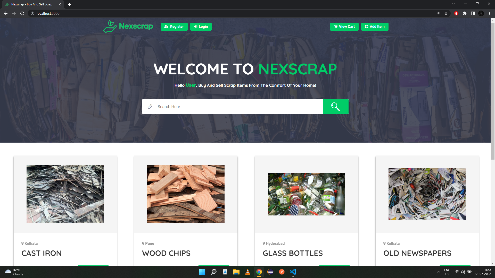

# nexscrap-classified

**Description** : Web Application to Buy/Sell Scrap Items

**Tech Stack** : Django, SQLite3, Boostrap, VanillaJS

**Overview** :

1. **Django** : Manages CRUD operations for items and users data storage within a database.
2. **SQLite3 Database** : Provides database storage for items and users information.
3. **Boostrap** : Renders backend endpoints to support dynamic user interface rendering.
4. **VanillaJS** : Manages additional functionalities for Twilio and Razorpay integrations.

**How to Run (Windows)** :

1. Install requirements.txt to install necessary packages [**pip install -r requirements.txt**]
2. Go to nexscrap -> settings.py -> Edit line nos. 133-138 and add your own Razorpay and Twilio credentials
3. Run server on localhost [**python manage.py runserver**]
4. Go to http://localhost:8000 on your browser to visit Nexscrap Home
5. Go to http://localhost:8000/admin on your browser to visit Admin Panel

**Pre-Existing User Credentials** :

1. Superuser -> Username : admin, Password : admin123
2. User1 -> Username : buyer, Password : buyer123
3. User2 -> Username : seller, Password : seller123

**How to Remove existing DB & Make new DB** : 

1. Delete the db.sqlite3 file
2. Create new migration [**python manage.py makemigrations**]
3. Run the new migration [**python manage.py migrate**]
5. Create new Superuser [**python manage.py createsuperuser**]

**Sample Screenshot** :

**API Documentation** :

1. **Homepage** -> GET /
2. **Search Items** -> GET /search
3. **Add Item to Database** -> POST /add_item
4. **View Item Description** -> GET /item_description/{pk}
5. **View Item Image** -> GET /item_image/{pk}
6. **Add Item to Cart** -> POST /add_to_cart/{pk}
7. **View Order List** -> GET /order_list
8. **Remove Item from Cart** -> POST /remove_from_cart/{pk}
9. **Checkout Page** -> GET /checkout
10. **Process Payment** -> POST /payment
11. **Handle Payment Request** -> POST /handlerequest
12. **View Invoice** -> GET /invoice
